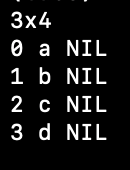
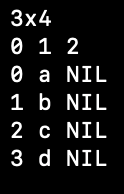

# Balancing Simplicity and Performance:

# An Oberon-based Data Frame Tool
 American University of Armenia

 Capstone Project submitted in fulfillment of the requirements for the degree of BS in Data Science

 Authhor: Irena Torosyan

 Supervisor: Norayr Chilingaryan

 May 9, 2024

## Abstract

This paper introduces a lightweight, user-friendly, and efficient command-line tool for interacting with tabular data and dataframes, developed using the Oberon programming language. The tool addresses the challenges of existing solutions that often trade-off between simplicity and functionality. The Oberon-based data frame tool offers a balance between these aspects, while maintaining a focus on ease of use and performance.

The design choices prioritize efficiency and flexibility. The core `Frame` module utilizes a generic data structure to handle various file formats without compromising core functionalities. Loaders and writers are implemented as separate modules, enabling format-agnostic data handling. Additionally, the `stats` module offers basic statistical analysis on data frames, demonstrating the tool's utility for data exploration tasks. Performance analysis reveals that the Oberon-based tool outperforms Python's Pandas library and the csvkit suite in terms of execution speed, highlighting the benefits of native code generation and strong typing offered by Oberon.

**Keywords:** Oberon, data frame, CSV, command-line tool, data exploration, performance analysis

## Introduction

In today's data-driven world, the ability to efficiently work with tabular data is needed across various domains, ranging from scientific research to business analytics. Among the variety of file formats used to store structured data, CSV (Comma-Separated Values) files are among the most used. However, despite their widespreadness, and simplicity of the format, efficiently managing and manipulating CSV files, along with their associated dataframes, can pose significant challenges.

Existing solutions for interacting with CSV files often come with trade-offs. While some tools offer powerful features and extensive functionality, they often suffer from complexity, resource overhead, or a steep learning curve. Conversely, simpler tools may lack essential functionalities or fail to provide an intuitive user experience.

Motivated by the need for a lightweight, user-friendly, and efficient tool for interacting with tabular data, this paper introduces an Oberon-based solution, designed to address these challenges. Leveraging the simplicity and efficiency of the Oberon language, this tool aims to provide a streamlined workflow for reading, storing, writing, performing simple modifications, and getting statistical inferences on tabular data.

This paper presents an exploration of the landscape of existing solutions for working with CSV files, highlighting their strengths, limitations, and areas for improvement. The reasons behind choosing the Oberon language as the foundation are discussed, emphasizing its suitability for programming tasks and its potential to deliver a lightweight yet powerful tool.

The aim of this paper is to showcase the practical utility of the tool,  while also discussing its potential for further development and expansion.

In the subsequent sections, we delve deeper into the technical details of the project, including its design, implementation, usage examples, and comparisons with existing tools. 

## Related Work: A Landscape of Tabular Data Exploration Tools

The desire to manipulate and analyze tabular data has a long history, with tools evolving to meet the needs of increasingly complex datasets and user demands. Visicalc, released in 1979, is considered a pioneer in this space. Its strength lay in its simplicity, allowing users to interact with spreadsheets through a user-friendly interface [1]. This simplicity and focus on ease-of-use serves as a core inspiration for the development of the Oberon-based data frame tool.

Modern data science offers a rich ecosystem of tools for working with tabular data. Popular options include R's data.frame, Python's pandas library [2], and the csvkit suite [3]. These tools offer a variety of functionalities, from data cleaning and transformation to complex statistical analysis.

**pandas**, perhaps the most widely used data analysis library in Python, excels in its flexibility and rich set of features. It allows for efficient data manipulation, advanced indexing, and powerful data cleaning capabilities. Pandas performs well when opposed to other popular tools for statistical data analysis and has been a very promising project since a decage ago. [4] However, pandas can be memory and time intensive for very large datasets, and its extensive functionality can come at the cost of a steeper learning curve.

**csvkit**, on the other hand, prioritizes speed and efficiency for working with CSV files. Its command-line interface offers a range of utilities for interacting with tabular data. While powerful for basic tasks, csvkit is implemented in a statically typed interpreted language which slows down its performance significantly. While the choice of python is justified in case of pandas, a simpler solution like csvkit, made to be used for simpler scenarios, can be implemented more efficiently without any loss of convenience. 

Beyond these two prominent examples, a variety of other tools cater to specific needs. For instance, dplyr in R provides a functional programming approach to data manipulation. 

The choice of tool ultimately depends on the specific needs of the user and the characteristics of the data. This Oberon-based data frame tool aims to strike a balance between the simplicity of and the efficiency of native code generation, offering a fast and easy-to-use solution for quick data exploration tasks.

## Data Frame Design

The core component of the Oberon-based tool is the `Frame` module, which provides a generic representation of a data frame. This design choice allows the tool to work seamlessly with various file formats without requiring modifications to the core functionality.

To optimize memory usage and facilitate later type checking, column names are stored separately from the data itself. This separation is reflected in the code by defining two distinct pointer types: `columnName` for storing column names as character arrays and `cnames` for referencing an array of `columnName` elements. Hence, column names themselves are not cells. As the column names are associated with a frame instance, the `frmDesc` record within the `frame` module holds a reference to the `cnames` type, denoted by `columnNames`.

The `Frame` module supports two basic data types for cells: integers (`intCell`) and strings (`strCell`). Both data types inherit from a common abstract base type `cellDesc`. This design promotes code reusability and simplifies the implementation of future data type extensions.

**Key Design Choices:**

* **Heterogeneous Columns:** The `Frame` allows columns to be heterogeneous, meaning cells within a single column can have different data types or be empty. This flexibility is achieved by using a generic `cell*` pointer type to reference cell data within the `matrix` of the `frmDesc` record. During data access, the code checks the specific cell type before performing operations like printing the value. This flexibility avoids unnecessary data conversions and maintains the integrity of the data during analysis. For instance, a column containing both numerical values and text representations can be stored efficiently without forcing a conversion to a single type. This design proves particularly advantageous in scenarios where, for instance, one seeks to derive statistical inferences solely from numerical values within a column. Enforcing uniform typing across the column would result in all cells being treated as strings, thereby complicating the further analysis process.

* **Type Checking:** While the design allows for heterogeneous columns, the `Frame` module can perform checks to ensure data type consistency before specific operations are applied. This approach avoids unnecessary type conversions during data exploration but ensures data integrity for calculations.

* **Separate Data Loading Logic:** The `Frame` module provides a generic interface for data loading through the `Tloader` procedure type. This allows for implementing different data loader functions specific to various file formats (e.g., CSV, Excel) without modifying the core frame functionality. The `setLoader` procedure assigns a specific loader implementation to a `frame` instance.

* **Object-Oriented Design Considerations:** One of the reasons why the implementation is passing the instance as an argument to a procedure is clarity. It makes the code clearer because it explicitly states which object the procedure is operating on. This can improve readability and maintainability. While this approach requires more typing, alternative solutions may cause noticable performance overhead due to virtual method tables (VMTs) [5]. Additionally, the compiler might be able to optimize the code better when it knows exactly which object the procedure is working on.

**Future Enhancements:**

The current implementation lays a solid foundation for future development. The design allows for:

* **Extensible Data Types:** The use of an abstract base class (`cellDesc`) facilitates the addition of new data types (e.g., floating-point numbers, dates) without significant code modifications.

## Loaders and Writers

This section discusses the design of loaders and writers, emphasizing their role in achieving format agnostic data handling for the data frame.

**Current Implementations: ReadCSV**

The `readcsv` module serves as the current implementation for loading data from CSV files. Here's a breakdown of its key characteristics:

* **Automatic Schema Discovery:** The `discoverAndSetSize` procedure automatically determines the frame's size (number of rows and columns) by analyzing the CSV file.
* **Column Name Handling (Optional):** The `ReadCSVFile` procedure can handle files with column names in the first row. These names are stored in the frame's `columnNames` property.
* **Data Type Inference:** During data loading, `readcsv` infers the data type for each cell.

**WriteCSV: Saving Data Frames**

The `writecsv` module provides functionality to save a data frame to a CSV file. It mirrors the structure of `readcsv` and exhibits the following properties:

* **Column Name Handling:** If the frame has column names, they are written as the first row in the output file.
* **Data Type Handling:**  `writecsv` converts data from the frame's cells into a string representation suitable for CSV format.

**Future Expansion and Format Agnosticism**

The current design allows for the addition of new loader and writer modules without affecting the core frame functionality. This modular approach promotes flexibility and simplifies the process of supporting various data formats in the future. Additionally, with the addition of new loaders and writers it will also be possible to easily convert file formats using one file format loader and a different file format writer with no added complexity. 

## Stats Module for Data Frame Analysis

The `stats` module provides functionalities for performing basic statistical analysis on a data frame. It can be used to calculate various statistics for individual columns or the entire frame.

**Key Features:**

* **Column-wise Analysis:** The current implementation allows analyzing data distribution, data types, and various statistical properties for each column in the frame. 
* **Data Type Inference:** As mentioned above, the inference of the column type may be helpful in specific scenarios. As statistics rely on cell types, `colTypeCellCnt` is implemented to infer the data type within a column by examining cell values.
* **Combined Functionality:** `colStats` offers a comprehensive analysis of a column, including data type, presence of NIL values, and calculations like sum, mean, median, minimum, maximum, and mode for integer data.
* **Separate Statistics:** If not all statistical information is necessary, the possibility of acessing specific statistics without the added complexity of calculating all others is available.
* **Efficiency Considerations:** The design avoids redundant traversals of the data. `colStats` calculates all statistics in a single pass through the column, improving efficiency. 
* **Frame-wise Analysis:** `frmStats` provides a convenient way to obtain a summary of all columns within a frame.

**Additional Considerations:**

* Currently, the module focuses on integer data types. Future enhancements could include support for additional data types.

## Performance Analysis of Statistical Tools on Data Frames

This analysis compares the performance of statistics measures on `frame`, Pandas (python 3.8 and 3.11 versions), and csvkit for statistical analysis on data frames. The tests were conducted on two datasets:

* `country_full.csv`: A relatively small file with 11 columns and around 250 rows.
* `people-10000.csv`: A larger dataset with 5 columns and around 10000 rows.

The tests were conducted 10 times each and the mean system times were used for the comparison. 

**Key Findings:**

* **frame stats outperforms both Pandas versions in all test cases.** It consistently achieved the fastest execution times. The average system time on `country_full.csv` is 154 times faster than pandas on python 3.11 and 122 times faster than pandas on python 3.8. The average system time on `people-10000.csv` is 18 times faster than pandas on python 3.11 and 13 times faster than pandas on python 3.8.
* **csvkit is generally faster than Pandas but slower than frame stats** It exhibited reasonable performance on both datasets, except for the `people-10000.csv` with Python 3.8, where `csvkit` encountered an error and didn’t produce any results. The average system time on `country_full.csv` is 42 times faster than csvkit on python 3.11 and 75 times faster than csvkit on python 3.8. The average system time on `people-10000.csv` is 5 times faster than csvkit on python 3.11.
* **Python version appears to have minimal impact.** There were no significant performance differences between Python 3.8 and 3.11 for either Pandas or csvkit. Nevertheless, an interesting fact may be observed with pandas performance. With regular core CPython improvements [6] and introduction of Just-in-Time (JIT) Compilation [7], it was expected to see a significant increase in efficiency, but in case of this particular usage of pandas, quite the opposite may be observed. Pandas does not directly utilize JIT, so while the possibility is there, no increase in efficiency is noticeable. While the difference is not extreme, a possible reason for a more efficient work of pandas on python 3.8 may be that pandas relies on underlying C libraries that have specific compatibility optimizations for Python 3.8.

**Reasons for Performance Differences:**

**Native Code vs. Interpreted Languages:**

* **Oberon:** Being a compiled language, Oberon translates the code into machine code specific to the processor architecture. This native code executes directly on the hardware, making the tool very efficient.
* **Python:** Python is an interpreted language. The code is first translated into bytecode at runtime by the Python interpreter. The interpreter then executes this bytecode line by line. This interpretation adds an overhead compared to directly running native code. 

**Strong Typing in Oberon:**

* **Type Checking:** Oberon is a strongly typed language, meaning variable types are defined and enforced at compile time. This allows for better optimization by the compiler, as it knows the exact data types being manipulated.

I’d like to emphasize the significant role that static typing played in streamlining the development process. By explicitly defining variable types, the compiler catches potential errors early on, preventing runtime issues and saving valuable debugging time. This focus on type safety minimizes the chance of logic errors slipping through unnoticed, leading to a more robust and reliable codebase.

As the project grows and functionalities increase, maintaining a clean and efficient codebase becomes crucial. Oberon's static typing provides a safety net, allowing it to develop with confidence and focus on core functionalities. Compared to the experience with interpreted languages, where errors often manifest during runtime, Oberon's upfront type checking has been a refreshing change. It's a pleasure to work with a language that prioritizes catching errors early, leading to a smoother development cycle.

* **Python:** Python is dynamically typed, meaning variable types are determined at runtime. This flexibility can sometimes lead to inefficiencies as the interpreter needs to perform checks during execution to ensure type compatibility.

* **Data Type Focus:** Pandas offers comprehensive functionality but the basic statistics prioritize numerical data analysis. Frame stats and csvkit might be more efficient for mixed data types present in these tests.

**Additional Considerations:**

* **CPU Usage:** While system times provide a good performance indicator, CPU usage details could offer further insights. 

In the appendix the details of all testings are provided showing concrete details of each experiment. Frame stats used the least amount of cpu resources while performing the fastest in all tests.

## Tool Usage and Accessibility

The tool developed for this project leverages the Vishap Oberon compiler (voc) [8]. This compiler generates C code, enabling efficient execution on various platforms. 

**Current Implementation:**

* **C Code Output:** The Vishal Oberon compiler uses a C backend to translate Oberon code into machine code for the target platform. This approach offers several benefits:
	* **Platform Independence:** C code can be compiled and run on various operating systems with minimal modifications.
	* **Performance:** C code often executes faster than interpreted languages like Python, especially for computationally intensive tasks.

**Accessibility Considerations:**

* **Python Wrapper:** While the C code offers advantages, it creates a barrier for users primarily working in the Python ecosystem. To address this, we consider developing a Python wrapper for the tool. 

**Benefits of a Python Wrapper:**

* **Wider Audience:** A Python wrapper would significantly increase the tool's accessibility for users familiar with Python for data analysis.
* **Integration with Existing Workflows:** Users could seamlessly integrate the tool's functionalities into their existing Python-based data analysis pipelines.

## Conclusion

This paper presented the design and implementation of a novel command-line tool for interacting with CSV files and dataframes. Developed using the Oberon programming language, the tool prioritizes a balance between ease of use, efficiency, and core functionalities for data exploration tasks.

The key strengths of the tool lie in its design choices. The generic data structure of the `Frame` module facilitates format-agnostic data handling, while separate loader and writer modules enable flexible support for different file formats. The `stats` module provides basic statistical analysis capabilities, demonstrating the tool's usefulness for initial data exploration. Performance analysis revealed that the Oberon-based tool outperforms popular Python libraries like Pandas and the csvkit suite, highlighting the advantages of native code generation and strong typing offered by Oberon.

Looking forward, this project presents a solid foundation for further development. The design allows for the incorporation of additional data types, enhanced statistical functionalities, and support for new file formats. Additionally, the development of a Python wrapper could significantly broaden the user base and integrate the tool seamlessly into existing Python-based data analysis workflows. Overall, the Oberon-based data frame tool offers a compelling alternative for users seeking a lightweight, efficient, and user-friendly solution for data exploration tasks involving CSV files.

## Appendix 

**test comparisons**

## Resources

[1] Bricklin, D. J., & Frankston, W. C. (n.d.). VisiCalc: Information from its creators, Dan Bricklin and Bob Frankston. http://www.danbricklin.com/visicalc.htm

[2] pandas: a python data analysis library. https://pandas.pydata.org/

[3] csvkit: a suite of command-line tools for working with CSV files. https://csvkit.readthedocs.io/en/latest/

[4] McKinney, W. (2010). Data Structures for Statistical Computing in Python. Proceedings of the 9th Python in Science Conference, (Vol. 4, pp. 56 - 61).]). http://conference.scipy.org.s3.amazonaws.com/proceedings/scipy2010/pdfs/mckinney.pdf

[5] Chapman, C. (2024, February 22). The costs and benefits of interfaces. https://chapmanworld.com/the-costs-and-benefits-of-interfaces/

[6] Python Documentation. What's New in Python 3.11.
https://docs.python.org/3/whatsnew/3.11.html]

[7] Numba: A just-in-time compiler for Python. https://numba.pydata.org/numba-doc/latest/index.html

[8] voc: Vishap Oberon Compiler of the Oberon-2. https://github.com/vishaps/voc

[9] Oakwood Compiler Development Group. (1995, October 20). The Oakwood Guidelines for Oberon-2 Compiler Developers. http://www.math.bas.bg/bantchev/place/oberon/oakwood-guidelines.pdf

[10] Wirth, N. (2015, rev. 5.10.2015). Programming: A tutorial: A derivative of programming in Modula-2 (5th ed.). 

